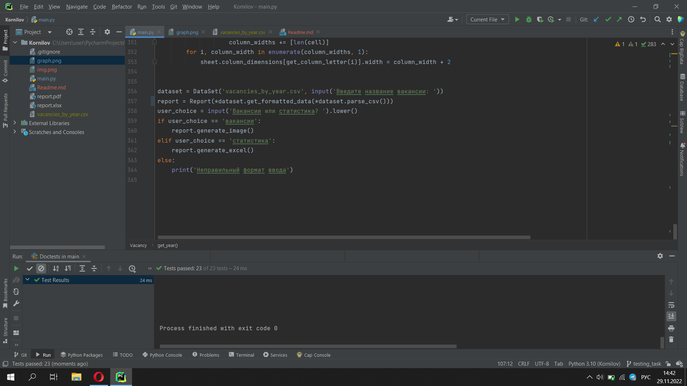
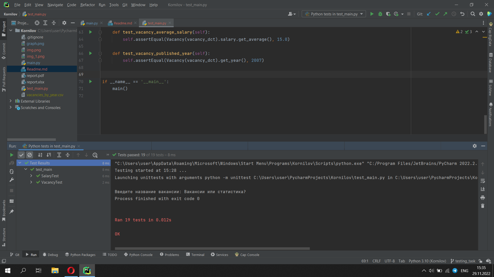
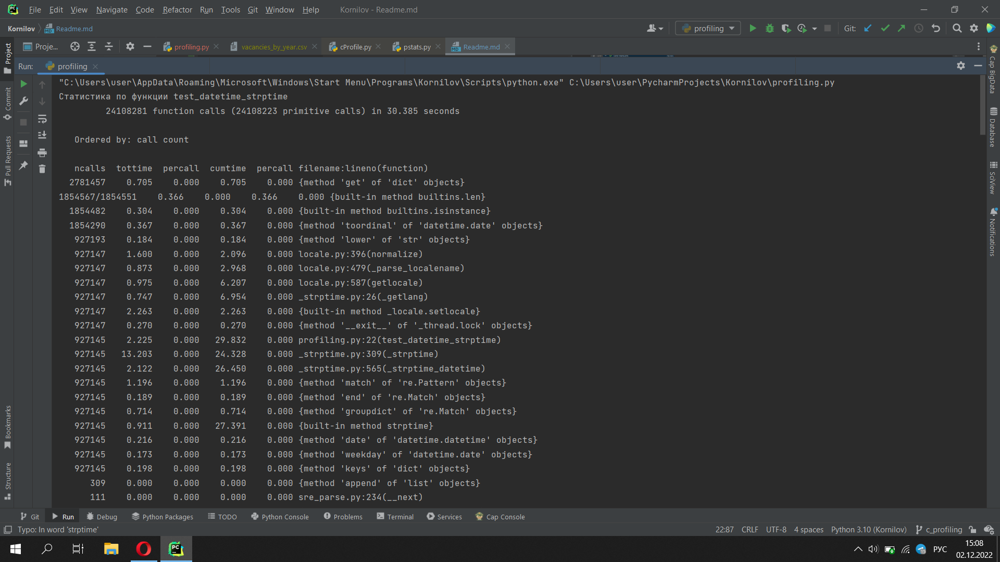
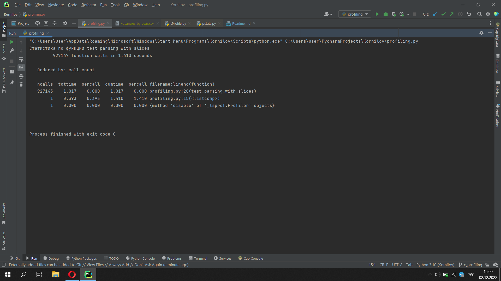
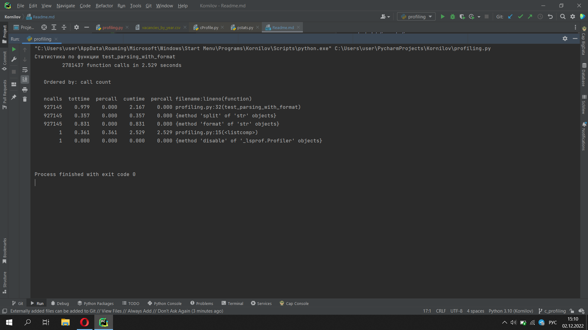
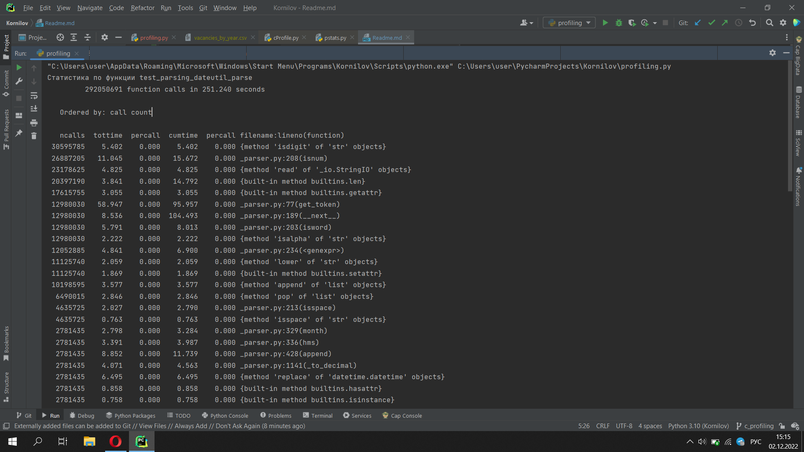
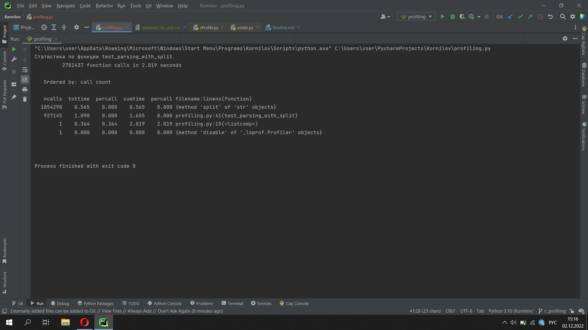
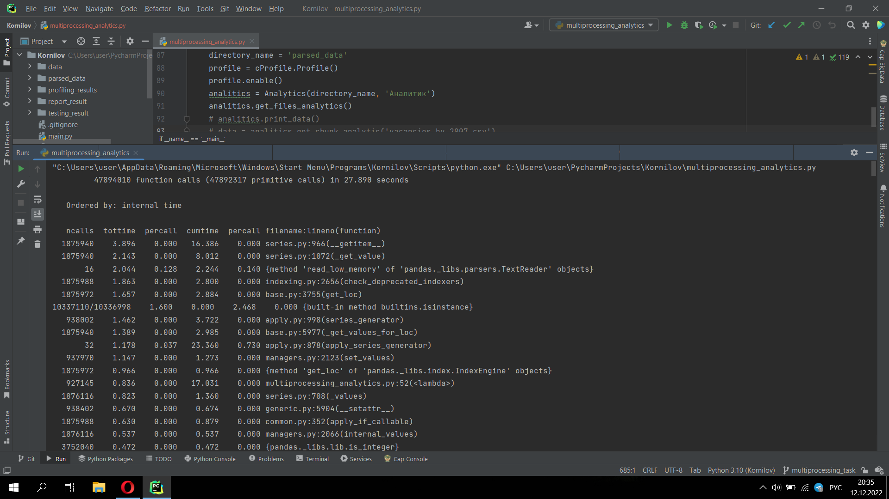
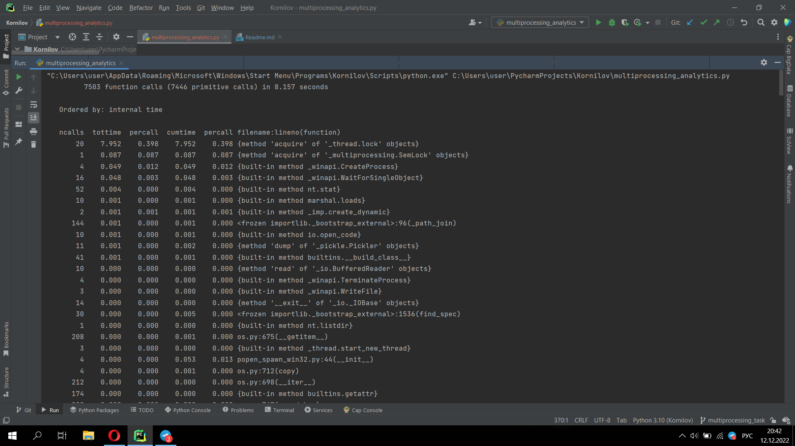

# Результаты выполнения тестов
## Результат doctests

## Результат unittest

# Результаты профилирования кода:
### В программе представлены 5 функций для парсинга даты
* test_datetime_strptime

* test_parsing_with_slices

* test_parsing_with_format

* test_parsing_dateutil_parse....

* test_parsing_with_split
* 
## Вывод: Функция "test_parsing_with_slices" показала наилучший результат на большом объеме данных
## Использование библиотек приводит к большим трудозатратам

# Результат профилирование кода обработки csv-чанков
## Без многопроцессорности

## С многопроцессорностью

